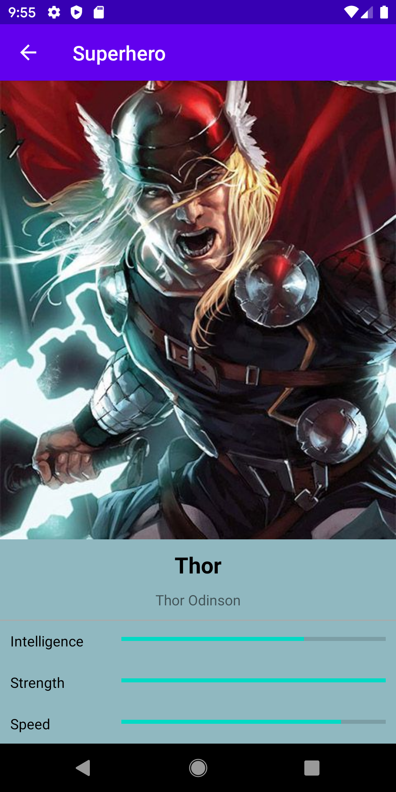

# Superheros
An app built in kotlin  illustrating MVVM Android Architecture 

Introduction
------------

The application uses Clean Architecture based on MVVM pattern. Implemented
Architecture principles follow Google recommended [Guide to app architecture](https://developer.android.com/jetpack/docs/guide).

TODO : Implement repository pattern

The application is written entirely in Kotlin.

Android Jetpack is used as an Architecture glue including but not limited to ViewModel, LiveData,
Navigation, Room and Data Binding.

The application does network HTTP requests via Retrofit and GSON. Loaded data is saved to
SQL based database Room, which supports offline mode.

Kotlin Coroutines manage background threads with simplified code and reducing needs for callbacks.

Glide is used for image loading.

Getting Started
---------------
Add your  **access token to api_developer_token in the gradle.properties file.** [Get Access Token](http://superheroapi.com/)

The app has a SeedDatabaseWorker that populates the app with 10 Superheros on install

The app allows you to **shake device to discover or pull to refresh to discover a superhero or villain**

Screenshots
-----------

Libraries Used
--------------

Android Jetpack is a set of components, tools and guidance to make great Android apps. They bring
together the existing Support Library and Architecture Components and arranges them into four
categories:

* [Android KTX]  - Write more concise, idiomatic Kotlin code.
* [Data Binding]- Declaratively bind observable data to UI elements.
* [LiveData]- Build data objects that notify views when the underlying database changes.
* [Navigation]- Handle everything needed for in-app navigation.
* [Room]- SQLite database with in-app objects and compile-time checks.
* [ViewModel]- Store UI-related data that isn't destroyed on app rotations. Easily schedule
     asynchronous tasks for optimal execution.
* [WorkManager] - Manage your Android background jobs.

* [UI] - Details on why and how to use UI Components in your apps - together or separate.
  * [Palette] - The Palette object gives you access to the colors in a image
  * [Fragment] - A basic unit of composable UI.
  * [Layout] - Lay out widgets using different algorithms.
  * [Material] - Material Components.
* Third party
  * [Kotlin Coroutines] for managing background threads with simplified code
     and reducing needs for callbacks.
  * [Retrofit ] A configurable REST client.
  * [GSON] A Json - Object converter using reflection.
  * [Glide] Image loading.

